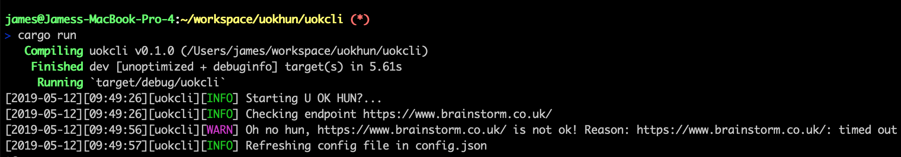

# U OK Hun? Status monitoring application

Very lightweight status monitoring app written in rust.

Aim of project:
 * Alert user when a web service goes down (or responds weirdly)
 * Use minimal CPU + memory
 * Work well in docker+kubernetes setup (configurable via env vars etc)
 * Teach @ravenscroftj how to build Rust applications.



## Requirements

Requires rust nigtly build and cargo (use [rustup](https://rustup.rs/)).


## Installation

Clone the git repo

```shell
git clone https://github.com/ravenscroftj/uokhun.git
```

Build the application

```shell
cargo build --release
```

## Configuration

uokhun uses a JSON config file that tells it which HTTP endpoints it should call, what parameters it should use, how regularly and who to notify when something isn't working.

Create a file called config.json

```json
{
    "endpoints":[
        {
            "url": "https://www.google.com/",
            "method": "GET",
            "period": 30
        }
    ]
}
```

This will make uokhun request `https://www.google.com/` every 30 minutes and produce a warning if it goes down.

## Running uokhun

Run the application with

```shell
./target/release/uokcli
```

You can tell uokhun where the config file is by setting the environment variable `UOKHUN_CONFIG_FILE`. I have a todo open that will allow you get uokhun to pull its config file froma HTTP endpoint but for now only local filesystem is supported.
